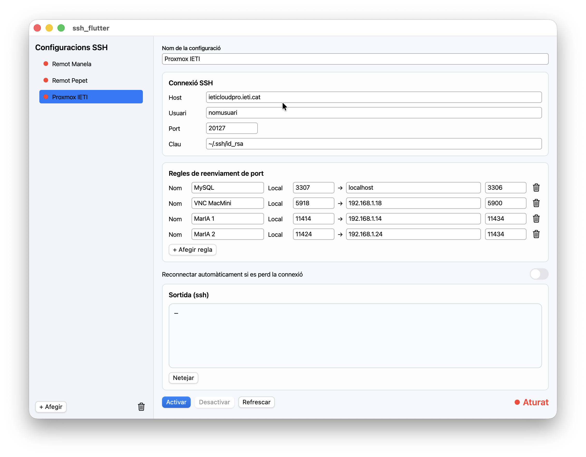

# SSH Tunnel

Aplicació per crear i gestionar túnels SSH (port forwarding local) amb interfície gràfica.

## Exemple de configuració



## Versions del projecte

- `SSH-Flutter/`: versió Flutter (macOS, Linux, Windows).
- `SSH-MacOS/`: versió nativa macOS (SwiftUI).

## Requisits

- Client OpenSSH (`ssh`) instal·lat.
- En macOS/Linux: `lsof` i `ssh-keyscan` disponibles.

## Execució ràpida

### Flutter

```bash
cd SSH-Flutter
flutter config --enable-macos-desktop
# Si falta la carpeta macos/ al projecte:
# flutter create --platforms=macos .
flutter pub get
flutter run -d macos   # o linux / windows
```

### macOS natiu

```bash
cd SSH-MacOS
./run.sh
```

## Nota sobre rutes de la clau

A la versió Flutter, les rutes de clau es normalitzen per fer-les més robustes:

- macOS/Linux: `$HOME/...` -> `~/...`
- Windows: `~`, `%USERPROFILE%`, `%HOMEDRIVE%%HOMEPATH%` i `$HOME` es resolen a ruta d'usuari
